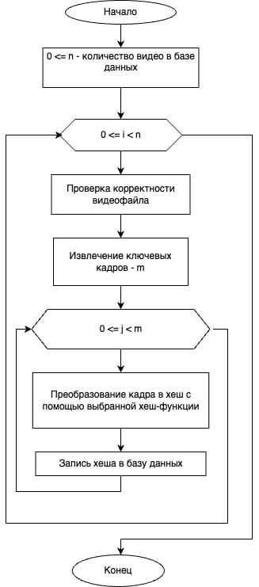
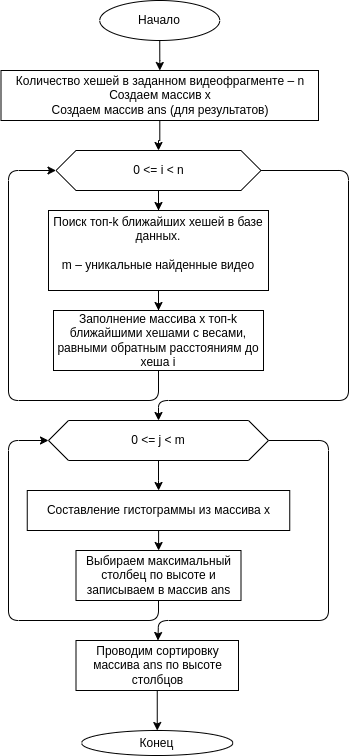

# [IVMEM'2025] Shazam Algorithm for Partial Video Copy Detection [Paper](https://ispranproceedings.elpub.ru/jour/article/view/2077)

Эксперименты по поиску видео по фрагменту.

Корректное научное название задачи: __Video copy detection, Partial video copy detection, video fingerprinting__

__Confluence:__ https://confluence.intra.ispras.ru/pages/viewpage.action?pageId=151031494

# Общая информация

## Протестированные хэш-функции

- [Marr-Hildreth (OpenCV)](https://docs.opencv.org/3.4/d4/d93/group__img__hash.html)
- [BlockMean, mode=0 (OpenCV)](https://docs.opencv.org/3.4/d4/d93/group__img__hash.html)
- [BlockMean, mode=1 (OpenCV)](https://docs.opencv.org/3.4/d4/d93/group__img__hash.html)
- [RadialVariance (OpenCV)](https://docs.opencv.org/3.4/d4/d93/group__img__hash.html)
- [phash (imagehash)](https://github.com/JohannesBuchner/imagehash)
- [whash (imagehash)](https://github.com/JohannesBuchner/imagehash)
- [dhash (imagehash)](https://github.com/JohannesBuchner/imagehash)

Не тестировались:
- [colorhash (imagehash)](https://github.com/JohannesBuchner/imagehash) т.к. значение зависит от цвета
- [ahash (imagehash)](https://github.com/JohannesBuchner/imagehash) т.к. является устаревшим

## Наборы данных

- VCDB [(статья)](https://link.springer.com/chapter/10.1007/978-3-319-10593-2_24) [(датасет)](https://drive.google.com/drive/folders/183i4LYlhcl0u4VBdzZmXnYvrEulEvAo9)

[Как добавить новый набор данных?](#как-добавить-новый-набор-данных)

## Метрики оценки качества

- [MRR (Mean Reciprocal Rank)](https://www.evidentlyai.com/ranking-metrics/mean-reciprocal-rank-mrr) $RR = \frac{1}{rank\ of\ the\ first\ correct\ result},\ MRR = mean(RR)$
- [MAP (Mean Average Precision)](https://www.evidentlyai.com/ranking-metrics/mean-average-precision-map) $AP = \frac{1}{N}\sum_{k=1}^{K}precision(k) \cdot rel(k),\ MAP = mean(AP)$
  * $precision(k) = \frac{number\ of\ relevant\ items\ at\ k}{k}$
  * $rel(k)$ = 1 if the item at position k is relevant and 0 otherwise
  * $N$ - overall number of relevant items
  * $K$ - top-K search
- [Recall](https://en.wikipedia.org/wiki/Precision_and_recall) $Recall = \frac{number\ of\ relevant\ items\ retrieved}{number\ of\ relevant\ items}$
- Found original $Found\ original = \frac{number\ of\ found\ original\ items}{number\ of\ videos}$

## Дерево проекта

- Дерево датасета смотреть в разделе [Как добавить новый набор данных?](#как-добавить-новый-набор-данных)
- Проект после завершения экспериментов должен иметь следующую структуру:
- Скачать `core_dataset` в итоговом варианте: https://at.ispras.ru/owncloud/index.php/f/888109

```
.
├── core_dataset # Результаты экспериментов
│   ├── hashes # Хэш-значения каждого видео в базе данных (.json), индексы annoy (.ann), замеры скорости (.csv)
│   │   ├── BlockMean0
│   │   ├── BlockMean1
│   │   ├── dhash
│   │   ├── Marr-Hildreth
│   │   ├── phash
│   │   ├── RadialVariance
│   │   └── whash
│   ├── metadata.csv # Метаданные базы данных
│   ├── quality_metrics.csv # Метрики качества
│   ├── quality_plots # Визуализация метрик качества (.png)
│   ├── quality_plots_0.log
│   ├── quality_plots.log
│   ├── quality_process_0.log
│   ├── query_hashes # Хэш-значения каждого запросного видео (.json), замеры скорости (.csv)
│   │   ├── BlockMean0
│   │   ├── BlockMean1
│   │   ├── dhash
│   │   ├── Marr-Hildreth
│   │   ├── phash
│   │   ├── RadialVariance
│   │   └── whash
│   ├── query_metadata.csv # Метаданные запросных видео
│   ├── search_process.log
│   ├── Shazam # Результаты экспериментов (.json), качество поиска (.csv), замеры скорости (.csv)
│   │   ├── BlockMean0
│   │   ├── BlockMean1
│   │   ├── dhash
│   │   ├── Marr-Hildreth
│   │   ├── phash
│   │   ├── RadialVariance
│   │   └── whash
│   └── video_process.log
├── data_structures # Структуры данных
│   ├── annoy_db.py
│   ├── distance_item_result.py
│   ├── frame_hash.py
│   ├── quality_result_folder.py
│   ├── quality_result.py
│   ├── search_item_result.py
│   ├── search_result.py
│   ├── video_hash.py
│   ├── video_keyframe.py
│   ├── video_metadata.py
│   └── video_query_metadata.py
├── docs # документация
│   └── media
│       ├── image1.png
│       └── image2.png
├── entities # сущности
│   ├── annoy_processor.py
│   ├── video_annotation_parser.py
│   ├── video_keyframe_extractor.py
│   └── video_processor.py
├── .flake8 # настройки линтера
├── frame_hashers # хэш-функции
│   ├── abstract_frame_hasher.py
│   ├── block_mean_image_hasher.py
│   ├── dhash_image_hasher.py
│   ├── marr_hildreth_image_hasher.py
│   ├── phash_image_hasher.py
│   ├── radial_variance_image_hasher.py
│   └── whash_image_hasher.py
├── .gitignore
├── main.py # пустой файл
├── pyproject.toml # настройки линтера и автоформатирования для ruff
├── quality_plotters # визуализация метрик качества
│   ├── abstract_metric_plotter.py
│   ├── folder_metric_plotter.py
│   ├── global_metric_plotter.py
│   └── time_metric_plotter.py
├── README.md
├── requirements.lint.txt # зависимости для линтера
├── requirements.txt # зависимости для проекта
├── scripts # основные скрипты для запусков экспериментов
│   ├── multiprocessing.sh
│   ├── post_processing_query.sh
│   ├── post_processing_search.sh
│   ├── post_processing_video.sh
│   ├── pre_search_process.py
│   ├── quality_plots.py
│   ├── quality_process.py
│   ├── query_process.py
│   ├── search_process.py
│   └── video_process.py
└── search_algorithms # алгоритмы поиска
    └── shazam_search.py

```

## Эксперимент

### Перед запуском экспериментов

#### Установка зависимостей

1.Эксперименты запускаются на python3.8+. Нужно установить зависимости:
```shell
pip3 install requirements.txt
```
2. Установить `ffmpeg`
```shell
sudo apt-get install ffmpeg
```

#### Подготовка датасета

1. Выбрать директорию для хранения датасета. Например `data/`
2. Скачать весь [диск (VCDB_core)](https://drive.google.com/drive/folders/1xI1uGB8b1u6CJ1DHRtboL4zDdKVG1062) и расположить в директории `data/`
3. Разархивировать `VCDB_core.zip`
```shell
cd data/
zip -s- VCDB_core.zip -O VCDB_core_combined.zip
unzip VCDB_core_combined.zip
rm VCDB_core.zip VCDB_core_combined.zip
```
4. Создать директорию для хранения результатов. Например `core_dataset`

### Описание алгоритма поиска (Shazam)

**Загрузка видео в датасет/базу данных:**



1. Извлечение ключевых кадров из видео

2. Вычисление векторов для каждого кадра

3. Сохранение векторов в базу данных

**Поиск видео по фрагменту:**



1-2. Как при загрузке видео в базу данных

3. Поиск k ближайших соседей для вектора кадра запросного видео среди всех векторов в базе данных по евклидову расстоянию

4. Подстроение для каждого найденного видео гистрограммы и выбор наибольшего значения - это лучший таймкод начала фрагмента для каждого найденного видео

5. Ранжирование найденных видео по выбранным значениям

6. Вывод топ-k' наиболее релевантных видео

#### Описание эксперимента
На данный момент код работает в основном на CPU

Для удобства, весь процесс поиска видео по фрагменту состоит из 5 частей (одна часть - один скрипт из `scripts/`):

1. Вычисление векторов для всех видео в датасете [`scripts/video_process.py`](scripts/video_process.py)

2. Вычисление векторов для всех запросных видео [`scripts/query_process.py`](scripts/query_process.py)

3. Индексация векторов в базе данных [`scripts/pre_search_process.py`](scripts/pre_search_process.py)

4. Сам поиск каждого запросного видео среди всех видео в датасете [`scripts/search_process.py`](scripts/search_process.py)

5. Подсчет метрик [`scripts/quality_process.py`](scripts/quality_process.py)

6. Визуализация метрик [`scripts/quality_plots.py`](scripts/quality_plots.py)

#### Оптимизации экспериментов (Unix)

1. Скрипты 1-4 долго работают, поэтому используется мультипроцессинг [`scripts/multiprocessing.sh`](scripts/multiprocessing.sh)

2. Оптимальное количество процессов для запуска `<кол-во потоков в CPU> / 2`. Это число задается в скрипте `scripts/multiprocessing.sh` через `-B`. Будем использовать 14 процессов (половина от 28 потоков в CPU)

3. Чтобы скрипт работал в фоне, используется `screen ... &`

4. После завершения каждой части 1-2, 4. Используется соответствующий скрипт для агрегации результатов.

    1. [`scripts/post_processing_video.sh`](scripts/post_processing_video.sh)
    
    2. [`scripts/post_processing_query.sh`](scripts/post_processing_query.sh)

    3. [`scripts/post_processing_search.sh`](scripts/post_processing_search.sh)

Результаты экспериментов по ускорению можно найти в [отчете](https://confluence.intra.ispras.ru/pages/viewpage.action?pageId=151031494)

#### Запуск с оптимизациями

Запуск каждой части эксперимента делается после завершения предыдущей.

```bash
# 1
screen ./scripts/multiprocessing.sh scripts/video_process.py -i data -o core_dataset -B 14 &
./scripts/post_processing_video.sh

# 2
screen ./scripts/multiprocessing.sh scripts/query_process.py -i data/annotation/ -o core_dataset -B 14 &  
./scripts/post_processing_query.sh

# 3
screen ./scripts/multiprocessing.sh scripts/pre_search_process.py -i core_dataset -o core_dataset -B 14 &  

# 4
screen ./scripts/multiprocessing.sh scripts/search_process.py -i core_dataset -o core_dataset -B 14 &  
./scripts/post_processing_search.sh core_dataset

# 5
PYTHONPATH=. python scripts/quality_process.py -i data/ -o core_dataset

# 6
PYTHONPATH=. python scripts/quality_plots.py -i core_dataset -o core_dataset
```

#### Результаты

| Search Name | Hash Name     | MRR   | mAP   | Recall | Found original |
|-------------|---------------|-------|-------|--------|----------------|
| Shazam      | Marr-Hildreth | 0.805 | 0.766 | 0.528  | 0.963          |
| Shazam      | BlockMean0    | 0.801 | 0.760 | 0.533  | 0.961          |
| Shazam      | BlockMean1    | 0.813 | 0.766 | 0.556  | 0.970          |
| Shazam      | RadialVariance| 0.817 | 0.774 | 0.527  | 0.956          |
| Shazam      | phash         | 0.785 | 0.727 | 0.577  | 0.949          |
| Shazam      | whash         | 0.767 | 0.722 | 0.544  | 0.942          |
| Shazam      | dhash         | 0.787 | 0.731 | 0.573  | 0.948          |

Результаты по каждой категории видео и все промежуточные результаты можно найти на [ownCloud](https://at.ispras.ru/owncloud/index.php/apps/files/?dir=/VCDB_frame_video_search&fileid=888129)

Скорость алгоритмов и еще больше результатов можно найти в [отчете](https://confluence.intra.ispras.ru/pages/viewpage.action?pageId=151031494)

## Как добавить новый набор данных?

Структура датасета должна быть следующей:

```
.
├── annotation # пары совпадающих фрагментов из разных видео
│   ├── baggio_penalty_1994.txt
│   ├── beautiful_mind_game_theory.txt
│   ├── ...
├── core_dataset # видео, разделенные на категории (напр. baggio_penalty_1994, beautiful_mind_game_theory, ...)
    ├── baggio_penalty_1994
    ├── beautiful_mind_game_theory
    ├── ...

```

Пример пары совпадающих фрагментов из разных видео в `annotation/*.txt`:

```
3504e360accbaccb1580befbb441f1019664c2bb.mp4,3504e360accbaccb1580befbb441f1019664c2bb.mp4,00:00:00,00:00:09,00:00:00,00:00:09
3504e360accbaccb1580befbb441f1019664c2bb.mp4,37b31d607d31a47d347b15dae2b8aa63e57861eb.flv,00:00:03,00:00:05,00:00:33,00:00:35
3504e360accbaccb1580befbb441f1019664c2bb.mp4,37b31d607d31a47d347b15dae2b8aa63e57861eb.flv,00:00:03,00:00:05,00:00:41,00:00:45
...
```
Где столбцы:
1. Имя A видео
2. Имя B видео
3. Время начала фрагмента в A видео
4. Время конца фрагмента в A видео
5. Время начала фрагмента в B видео
6. Время конца фрагмента в B видео

Путь до видео: `core_dataset/<название txt файла>/<название A/B видео>`

Пример: `core_dataset/baggio_penalty_1994/3504e360accbaccb1580befbb441f1019664c2bb.mp4`
